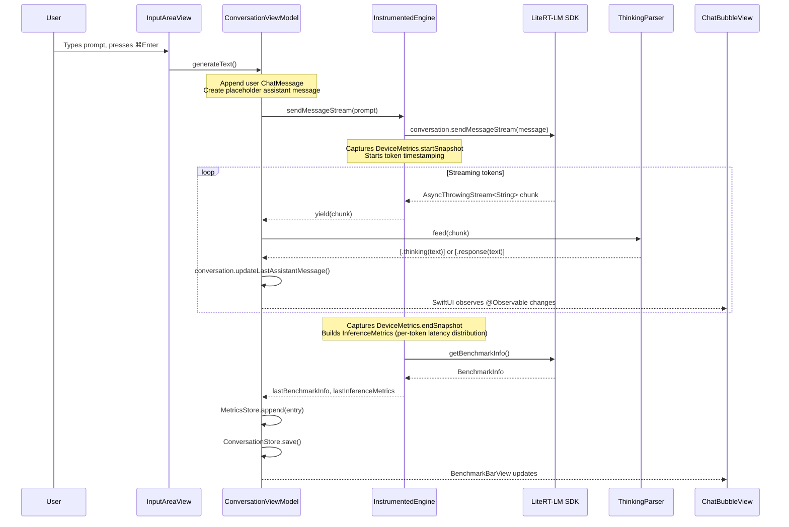
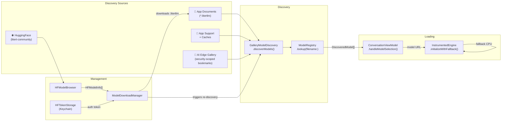
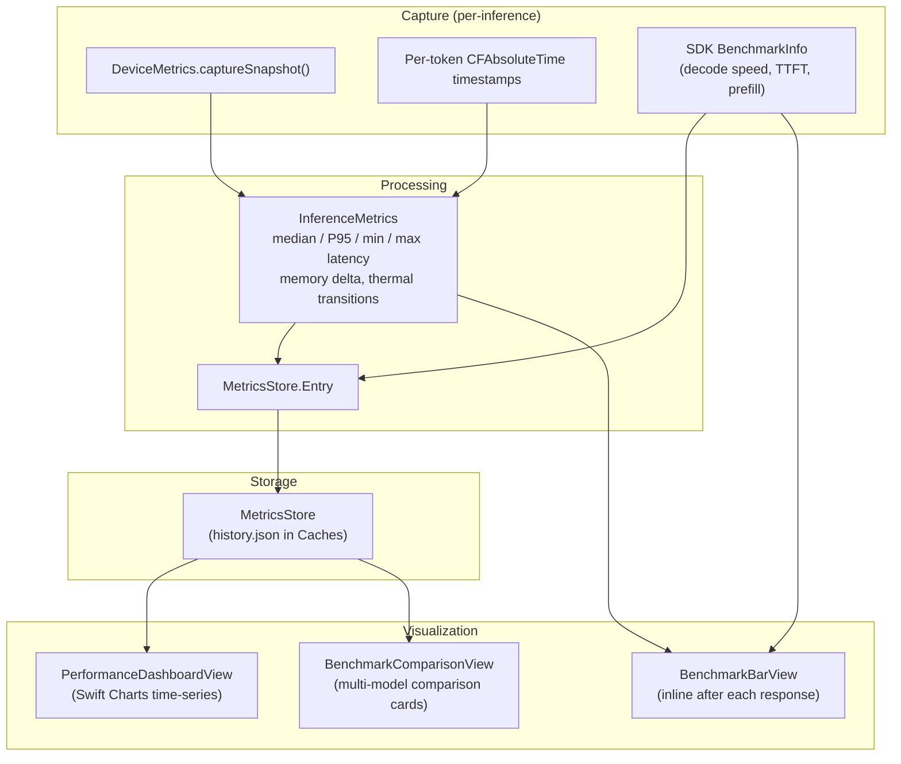
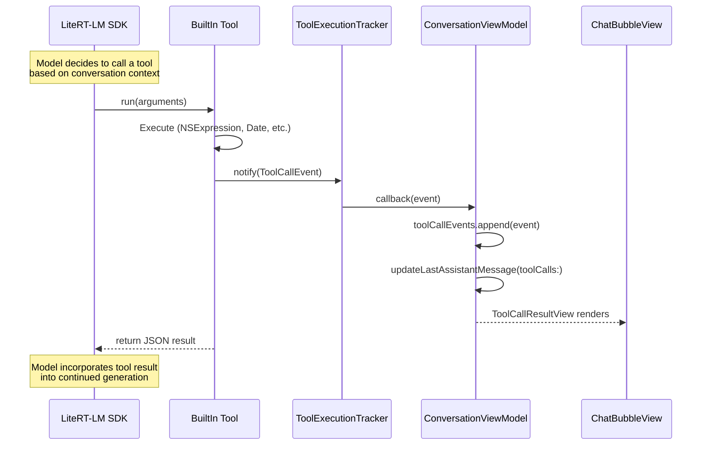
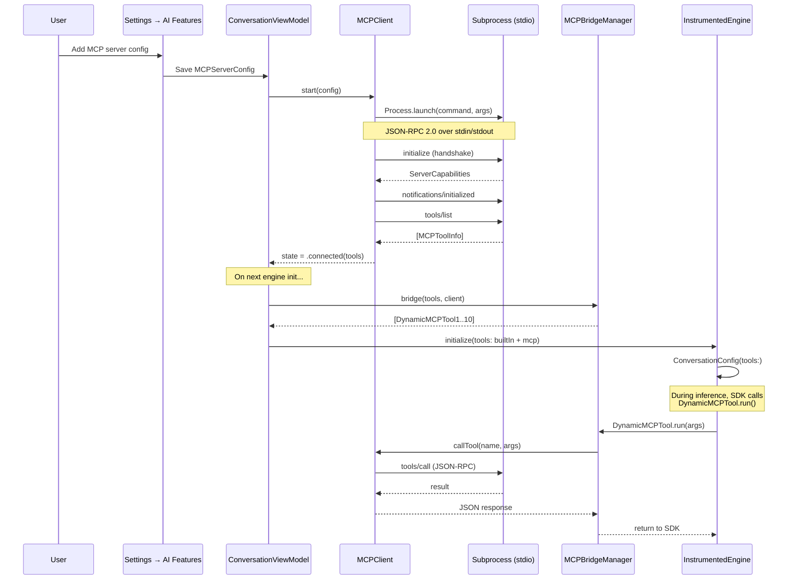

# Architecture

> Edge AI Lab — On-device Gemma 4 inference for macOS & iOS, powered by LiteRT-LM.

This document describes the architecture of Edge AI Lab for contributors and reviewers. It covers the module structure, key protocols, data flows, and design decisions.

**85+ Swift source files · 14 architectural layers · ~20K lines of production code**

---

## Table of Contents

- [Module Overview](#module-overview)
- [Layer Dependency Diagram](#layer-dependency-diagram)
- [Key Protocols](#key-protocols)
- [Data Flows](#data-flows)
  - [Inference Pipeline](#1-inference-pipeline)
  - [Model Discovery & Download](#2-model-discovery--download)
  - [Benchmark Capture & Visualization](#3-benchmark-capture--visualization)
  - [Tool Calling](#4-tool-calling)
  - [MCP Server Integration](#5-mcp-server-integration-macos)
- [Design Decisions](#design-decisions)
- [Where to Find Things](#where-to-find-things)
- [Testing Architecture](#testing-architecture)

---

## Module Overview

The codebase is organized into 12 logical layers. Each layer has a clear responsibility and well-defined dependencies:

| Layer | Files | Responsibility |
|-------|------:|----------------|
| **App** | 1 | Entry point, window configuration, keyboard shortcuts |
| **Views** | 20+ | SwiftUI views — sidebar, chat, settings, benchmarks, model browser, URL import, eval |
| **ViewModel** | 2 | `@Observable` state management, inference orchestration |
| **Engine** | 1 | LiteRT-LM wrapper with instrumentation and smart fallback |
| **Tools** | 8 | Built-in tools (6) + agent skills (2) for function calling |
| **MCP** | 4 | Model Context Protocol client (stdio JSON-RPC, macOS only) |
| **Model Management** | 8 | Model registry, HuggingFace browser, Kaggle parser, dynamic catalog, URL import |
| **Persistence** | 3 | JSON file-based conversation and metrics storage |
| **Eval Framework** | 5 | Eval suites, runner, store, batch orchestrator |
| **Benchmarking** | 3 | Device metrics, performance dashboard, automation harness |
| **Onboarding** | 2 | First-run welcome flow |
| **Design System** | 1 | "Dark Forest" theme tokens — colors, typography, spacing |
| **Settings** | 6 | Inference settings (general, sampler, AI features, data, Kaggle) |
| **Utilities** | 2 | `ThinkingParser`, `ChatMessage` data models |

---

## Layer Dependency Diagram

```mermaid
graph TB
    subgraph "App Layer"
        APP["GemmaEdgeGalleryApp"]
    end

    subgraph "View Layer"
        CV["ContentView"]
        SB["SidebarView"]
        DC["DetailColumnView"]
        CA["ConversationAreaView"]
        CB["ChatBubbleView"]
        IA["InputAreaView"]
        BB["BenchmarkBarView"]
        PD["PerformanceDashboardView"]
        BC["BenchmarkComparisonView"]
        HF["HFModelCard / HFModelBrowserView"]
        MS["ModelShowcaseView"]
        SV["StatusBarView"]
    end

    subgraph "ViewModel Layer"
        VM["ConversationViewModel"]
        VM_MCP["ConversationViewModel+MCP"]
    end

    subgraph "Engine Layer"
        EP["InstrumentedEngineProtocol"]
        IE["InstrumentedEngine"]
        ME["MockInstrumentedEngine"]
    end

    subgraph "Tool Layer"
        TR["ToolRegistry"]
        CALC["CalculatorTool"]
        DT["DateTimeTool"]
        DI["DeviceInfoTool"]
        UC["UnitConverterTool"]
        TA["TextAnalyzerTool"]
        SH["SystemHealthTool"]
        AS["AgentSkills (Wiki/Maps)"]
    end

    subgraph "MCP Layer"
        MC["MCPClient"]
        MSC["MCPServerConfig"]
        DMB["DynamicMCPBridge"]
    end

    subgraph "Model Management"
        MR["ModelRegistry"]
        MM["ModelMetadata"]
        MD["ModelDownloadManager"]
        GD["GalleryModelDiscovery"]
        HFB["HFModelBrowser"]
        HFT["HFTokenStorage"]
        UIM["URLImportManager"]
        MCP2["ModelCardParser"]
        DMC["DynamicModelCatalog"]
        KGP["KaggleModelParser"]
        KTS["KaggleTokenStorage"]
    end

    subgraph "Eval Framework"
        ER["EvalRunner"]
        ES["EvalStore"]
        BIS["BuiltInEvalSuites"]
        BEO["BatchEvalOrchestrator"]
    end

    subgraph "Persistence Layer"
        CS["ConversationStore"]
        SC["SavedConversation"]
        MTS["MetricsStore"]
    end

    subgraph "Benchmarking"
        DM["DeviceMetrics"]
        DAH["DeveloperAutomationHarness"]
    end

    subgraph "Design System"
        DS["DesignSystem"]
    end

    subgraph "Settings Layer"
        ISV["InferenceSettingsView (5 files)"]
        EC["ExperimentConfig"]
        EF["ExperimentalFlagsState"]
    end

    subgraph "Utilities"
        CM["ChatMessage / ConversationState"]
        TP["ThinkingParser"]
    end

    subgraph "External SDK"
        LRT["LiteRT-LM (LiteRTLM)"]
    end

    APP --> CV
    CV --> SB & DC & CA & IA & BB & PD & SV & ISV
    CA --> CB
    SB --> VM & MR & MD
    DC --> VM & PD & BC
    IA --> VM
    BB --> VM & DM
    PD --> MTS
    BC --> MTS
    HF --> MD
    MS --> VM & MM

    VM --> EP & MTS & CS & MD & GD & TR & TP & CM & EC & EF
    VM --> AS & MC & DMB & MSC
    VM_MCP --> MC & MSC

    EP -.-> IE & ME
    IE --> LRT & DM & EF & MR

    TR --> CALC & DT & DI & UC & TA & SH
    DI & SH --> DM

    MC --> MSC
    DMB --> MC & LRT

    MD --> GD & HFB & HFT & MR
    GD --> MR

    CS --> SC
    SC --> EC & CM

    DAH --> VM & GD & MTS

    ISV --> VM & EF & MC & MSC & HFT

    DS -.->|"tokens used by"| CV & SB & DC & CA & CB & IA & BB & PD & BC & SV & ISV

    style APP fill:#1a1a2e,stroke:#00bfa5,color:#e0e0e0
    style VM fill:#1a1a2e,stroke:#ff9800,color:#e0e0e0
    style IE fill:#1a1a2e,stroke:#f44336,color:#e0e0e0
    style EP fill:#1a1a2e,stroke:#f44336,color:#e0e0e0,stroke-dasharray: 5 5
    style LRT fill:#0d1117,stroke:#2196f3,color:#e0e0e0,stroke-width:2px
    style DS fill:#1a1a2e,stroke:#9c27b0,color:#e0e0e0
```



---

## Key Protocols

### `InstrumentedEngineProtocol`

The central abstraction for testability. All inference goes through this protocol:

```swift
protocol InstrumentedEngineProtocol: AnyObject {
    var isReady: Bool { get }
    var lastBenchmarkInfo: BenchmarkInfo? { get }
    var lastInferenceMetrics: InferenceMetrics? { get }
    var flagsState: ExperimentalFlagsState { get }

    func initializeWithFallback(...) async throws -> BackendResult
    func sendMessageStream(_ text: String, enableThinking: Bool) -> AsyncThrowingStream<String, Error>
    func resetConversation() async throws
    func warmup() async throws
    func cancelGeneration()
    func shutdown() async
}
```

| Conformer | Usage |
|-----------|-------|
| `InstrumentedEngine` | Production — wraps LiteRT-LM with os_signpost instrumentation |
| `MockInstrumentedEngine` | Tests — configurable mock for unit and integration tests |

### LiteRT-LM `Tool` Protocol

All built-in tools and MCP bridges conform to the SDK's `Tool` protocol. Each tool's `run()` method emits a `ToolCallEvent` through the `ToolExecutionTracker` singleton for real-time UI observability.

---

## Data Flows

### 1. Inference Pipeline

The core path from user prompt to rendered response:



### 2. Model Discovery & Download



### 3. Benchmark Capture & Visualization



### 4. Tool Calling



**Built-in tools** (all side-effect-free, offline-capable):

| Tool | Implementation | What It Does |
|------|---------------|--------------|
| `CalculatorTool` | `NSExpression` | Evaluates math expressions |
| `DateTimeTool` | `DateFormatter` | Current date/time/timezone |
| `DeviceInfoTool` | `ProcessInfo` + `DeviceMetrics` | Hardware and OS info |
| `UnitConverterTool` | Foundation `Measurement` | Unit conversions |
| `TextAnalyzerTool` | `NLLanguageRecognizer` | Word/sentence count, language detection |
| `SystemHealthTool` | `ProcessInfo` + `DeviceMetrics` | Thermal, memory, battery, disk |

**Agent Skills** (network-dependent, beta):

| Skill | API | What It Does |
|-------|-----|--------------|
| `WikipediaSkillTool` | Wikipedia REST API | Search articles, return extracts + thumbnails |
| `MapSkillTool` | MapKit `CLGeocoder` | Geocode locations, return coordinates |

### 5. MCP Server Integration (macOS)



> **Note**: MCP is macOS-only because iOS doesn't support subprocess spawning. The MCP layer is compiled out via `#if os(macOS)`.

---

## Design Decisions

### Why Protocol-Based DI for the Engine?

`InstrumentedEngineProtocol` enables injecting `MockInstrumentedEngine` in tests — no LiteRT-LM SDK, no model files, no GPU required. Tests run in < 1 second. The mock supports configurable responses, error injection, and benchmark simulation.

### Why JSON File Persistence (Not CoreData/SwiftData)?

- **Portability**: JSON files are human-readable, diffable, and exportable
- **Simplicity**: No migration schemas, no threading constraints, no Core Data stack
- **Forking**: Conversations can be forked by copying a JSON file and assigning a new UUID
- **Cross-platform**: Same format works on macOS and iOS with zero changes

### Why Is the Sandbox Disabled?

Three macOS-specific requirements force sandbox removal (see [SECURITY.md](SECURITY.md)):
1. Model files can live anywhere (shared directories, AI Edge Gallery paths)
2. MCP servers are launched as subprocesses (`Process`)
3. Cross-app model sharing via security-scoped bookmarks

### Why `branch("main")` for LiteRT-LM?

LiteRT-LM doesn't publish tagged SPM releases yet. We track `main` as a pragmatic choice. This is documented as a known limitation in [CHANGELOG.md](CHANGELOG.md).

### Dependency Injection via @Environment

The `App` struct owns `@State` instances of `ConversationViewModel` and `ModelDownloadManager`, then passes them into the view hierarchy via `.environment(ConversationViewModel.self)`. Views receive dependencies with `@Environment(ConversationViewModel.self)`. This avoids singletons — ownership is explicit and scoped to the app's lifetime. Settings changes (GPU toggle, sampler config, experimental flags) propagate immediately because all views share the same `@Observable` instance through the environment. Tests get isolated instances via `ConversationViewModel()`, with no shared state leaking between test cases.

### Why Static Tool Type Pool for MCP?

LiteRT-LM's `Tool` protocol requires conforming types at compile time. MCP tools are dynamic (discovered at runtime). `DynamicMCPBridge` pre-bakes 10 struct types (`DynamicMCPTool1..10`) that are configured at runtime with name/description/schema/handler. This bridges the static/dynamic gap without modifying the SDK.

---

## Where to Find Things

| I want to... | Look at... |
|--------------|------------|
| **Add a new built-in tool** | Create `Sources/YourTool.swift` conforming to LiteRTLM `Tool`, then add it to `ToolRegistry.defaultTools` |
| **Change the UI theme** | `Sources/DesignSystem.swift` — all colors, typography, spacing, and radius tokens |
| **Modify inference behavior** | `Sources/InstrumentedEngine.swift` — the core LiteRT-LM wrapper |
| **Add a new settings option** | `Sources/InferenceSettingsView+*.swift` — pick the appropriate tab file |
| **Change model metadata** | `Sources/ModelMetadata.swift` — `ModelRegistry.knownModels` static array |
| **Modify the chat UI** | `Sources/ChatBubbleView.swift` + `Sources/ChatBubbleComponents.swift` |
| **Change benchmark display** | `Sources/BenchmarkBarView.swift` (inline bar) or `Sources/PerformanceDashboardView.swift` (full dashboard) |
| **Add a new model source** | `Sources/GalleryModelDiscovery.swift` — add a new search path to `discoverModels()` |
| **Modify conversation persistence** | `Sources/ConversationStore.swift` (storage) + `Sources/SavedConversation.swift` (data model) |
| **Add an MCP feature** | `Sources/MCPClient.swift` (protocol) + `Sources/ConversationViewModel+MCP.swift` (lifecycle) |
| **Run automated benchmarks** | `Sources/DeveloperAutomationHarness.swift` — triggered via CLI launch args |
| **Change the sidebar layout** | `Sources/SidebarView.swift` — model list, conversations, benchmarks sections |
| **Update experiment tracking** | `Sources/ExperimentConfig.swift` — snapshot of config at conversation time |

---

## Testing Architecture

### Test Structure

| Category | Files | Purpose |
|----------|------:|---------|
| Unit Tests | 20 | Core logic: messages, persistence, settings, tools, parsing |
| Integration Tests | 5 | Multi-component flows: multi-turn, fallback, tool calling, downloads |
| Performance Tests | 2 | Benchmark baselines and gallery parity checks |
| UI Tests | 1 | End-to-end automation via XCUITest |
| Mock | 1 | `MockInstrumentedEngine` — configurable engine mock |

### Test Plans

| Plan | Test Classes | Timeout | Purpose |
|------|-------------|---------|---------|
| `UnitTests.xctestplan` | 23 classes | 60s | Fast feedback loop — runs in CI |
| `IntegrationTests.xctestplan` | 3 classes | 300s | Cross-component validation |
| `PerformanceTests.xctestplan` | 2 classes | 600s | Regression detection |

### Adding a Test

1. Create your test file in `Tests/` (e.g., `Tests/YourFeatureTests.swift`)
2. Import `@testable import GemmaEdgeGallery_macOS`
3. Use `MockInstrumentedEngine` for any test that touches the engine
4. Add your test class to the appropriate `.xctestplan`
5. Run: `xcodebuild test -workspace GemmaEdgeGallery.xcworkspace -scheme "Edge AI Lab" -only-testing:GemmaEdgeGallery_macOSTests`

---

<p align="center">
  <sub>Last updated: June 2026 · Edge AI Lab v1.0.0</sub>
</p>
