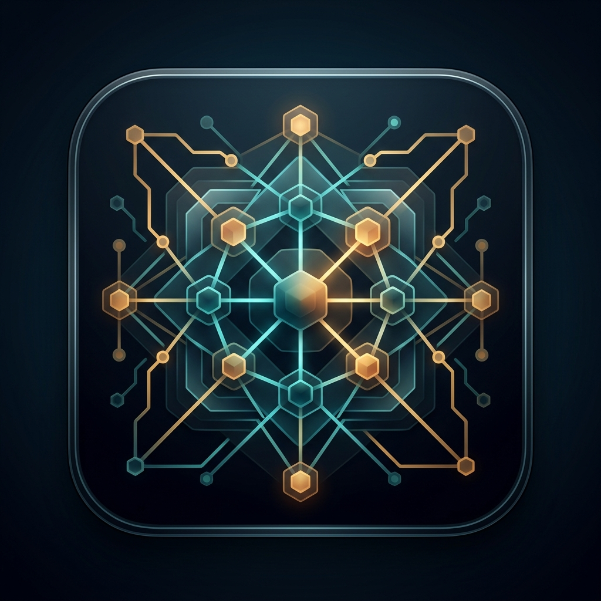
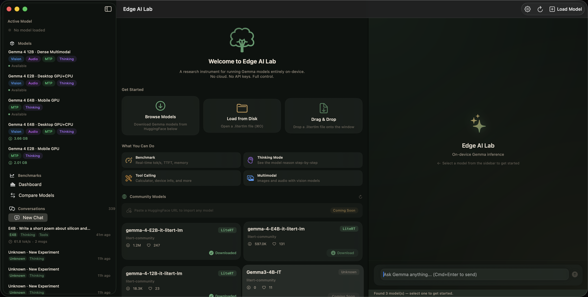
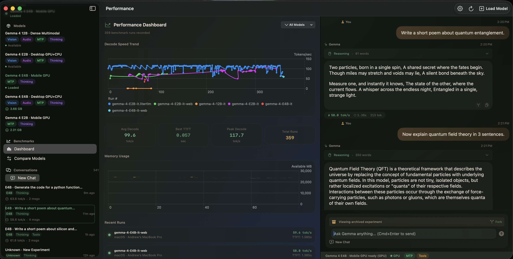

<p align="center">
  
</p>

<h1 align="center">Edge AI Lab</h1>

<p align="center">
  <strong>On-device Gemma 4 inference for macOS</strong><br/>
  <em>Run 2B → 12B parameter models entirely on your device. No cloud. No API keys. No compromise.</em>
</p>

<p align="center">
  
  
  
  
  
</p>

---

## Screenshots

<p align="center">
  
  <br/><em>Welcome view — model sidebar, HuggingFace browser, and hint cards</em>
</p>

<p align="center">
  
  <br/><em>Performance Dashboard with benchmark charts, thinking mode, and real-time inference metrics</em>
</p>

---

## What is Edge AI Lab?

Edge AI Lab is a research-grade macOS application that runs Google's [Gemma 4](https://blog.google/technology/google-deepmind/gemma-4/) language models directly on-device using [LiteRT-LM](https://github.com/google-ai-edge/LiteRT-LM). It's designed for developers, researchers, and power users who want to explore the capabilities of on-device AI without sending a single byte to the cloud.

### Key Capabilities

| Feature | Description |
|---------|-------------|
| **Multi-Model Gallery** | Switch between Gemma 4 E2B, E4B, and 12B Dense models. Download from HuggingFace or load from disk. |
| **Tool Calling** | 6 built-in tools (Calculator, DateTime, DeviceInfo, UnitConverter, TextAnalyzer, SystemHealth). The model invokes them autonomously during conversation. |
| **Agent Skills** `Beta` | Network-dependent tools (Wikipedia, Maps) that extend the model's capabilities beyond offline tooling. |
| **Thinking Mode** | Watch the model reason in real-time with collapsible `<think>` blocks. See the thought process behind every response. |
| **Multimodal Input** | Attach images and audio files directly in your prompts. Gemma 4's vision capabilities work entirely on-device. |
| **Deep Benchmarking** | Per-token latency histograms, P95 metrics, TTFT, memory deltas, and thermal state tracking. No other edge AI app goes this deep. |
| **Smart GPU Fallback** | Automatic GPU → CPU fallback with detailed diagnostics. Metal acceleration on supported hardware, XNNPACK fallback everywhere else. |
| **Performance Dashboard** | Historical metrics visualization with Swift Charts. Track decode speed trends across sessions and models. |
| **MCP Server Support** | Connect external MCP-compliant tool servers via stdio JSON-RPC. Extend the model's capabilities with custom tools. |
| **Conversation Persistence** | Auto-save conversations with full experiment metadata. Fork, rename, export, and resume sessions. |

---

## Quick Start

### Prerequisites

- **Xcode 26.0+** with Swift 6.0
- **[mise](https://mise.run)** — version manager (installs [Tuist](https://tuist.dev) from `.mise.toml`)
- **macOS 26.0+** (Tahoe) with **Apple Silicon** (M1 or later)
- ~3 GB free disk space for the smallest model (E2B), ~7 GB for 12B

### Build & Run

```bash
# 1. Clone
git clone https://github.com/AndrewVoirol/edge-ai-lab.git
cd edge-ai-lab

# 2. Install Tuist (version pinned by .mise.toml)
mise install

# 3. Generate Xcode project
tuist generate

# 4. Open in Xcode
open GemmaEdgeGallery.xcworkspace

# 5. Select scheme: "Edge AI Lab"
# 6. Build and Run (⌘R)
```

The app will auto-discover any `.litertlm` model files in your Documents folder. You can also download models directly from the built-in model gallery.

### Getting a Model

**Option A — Download in-app:**
Models from the `litert-community` HuggingFace org download without authentication. Click the download button on any model card in the sidebar.

**Option B — Manual download:**
Download from [Kaggle](https://www.kaggle.com/models/google/gemma-4) or [HuggingFace](https://huggingface.co/litert-community), then place the `.litertlm` file in:
- **macOS (debug build):** `{project-root}/models/`
- **macOS (release):** `~/Library/Application Support/com.andrewvoirol.GemmaEdgeGallery/models/`
- **iOS:** App Documents (visible in Files.app)

---

## Model Compatibility

| Model | Parameters | Size | Context | Multimodal | MTP | Recommended For |
|-------|-----------|------|---------|------------|-----|-----------------|
| **Gemma 4 E2B Standard** | 2B MoE | 2.6 GB | 128K | Vision + Audio | ✓ | Quick responses, development |
| **Gemma 4 E2B Web** | 2B MoE | 2.0 GB | 128K | — | ✓ | Lightweight text generation |
| **Gemma 4 E4B Standard** | 4B MoE | 4.4 GB | 128K | Vision + Audio | ✓ | Balanced quality & speed |
| **Gemma 4 E4B Web** | 4B MoE | 3.4 GB | 128K | — | ✓ | Desktop text workflows |
| **Gemma 4 12B Dense** | 12B | 6.5 GB | 256K | Vision + Audio | ✓ | Desktop power users, coding, analysis |

> **Recommended default on macOS:** Gemma 4 12B Dense — released June 3, 2026. Best quality for devices with 16+ GB RAM.

---

## Architecture

```
┌─────────────────────────────────────────┐
│            GemmaEdgeGalleryApp           │
│  ┌─────────────┐  ┌──────────────────┐  │
│  │ ContentView │  │ SettingsView     │  │
│  │  (SwiftUI)  │  │  (SwiftUI Form)  │  │
│  └──────┬──────┘  └──────────────────┘  │
│         │                                │
│  ┌──────┴──────────────────────────┐    │
│  │    ConversationViewModel        │    │
│  │    (@Observable, @MainActor)    │    │
│  └──────┬──────────────────────────┘    │
│         │                                │
│  ┌──────┴──────────────────────────┐    │
│  │  InstrumentedEngineProtocol     │    │
│  │  ├─ InstrumentedEngine (prod)   │    │
│  │  └─ MockInstrumentedEngine      │    │
│  └──────┬──────────────────────────┘    │
│         │                                │
│  ┌──────┴──────┐  ┌──────────────────┐  │
│  │  LiteRT-LM  │  │  ToolRegistry    │  │
│  │  (SDK)       │  │  (6 tools)      │  │
│  └─────────────┘  └──────────────────┘  │
└─────────────────────────────────────────┘
```

**Design Principles:**
- **Protocol-based DI** — `InstrumentedEngineProtocol` enables full mocking for tests
- **MVVM** — `@Observable` ViewModel drives all UI state
- **Swift 6 Concurrency** — `@MainActor`, `async/await`, `Sendable` throughout
- **Dark-mode-first** — Custom `DesignSystem.swift` with curated "Dark Forest" color palette

---

## Built-in Tools

The app includes 6 side-effect-free tools that the model can invoke autonomously:

| Tool | Description |
|------|-------------|
| `calculator` | Evaluates mathematical expressions |
| `date_time` | Returns current date, time, and timezone |
| `device_info` | Reports device model, OS version, memory, CPU cores |
| `unit_converter` | Converts between units (length, weight, temperature, etc.) |
| `text_analyzer` | Counts words, characters, sentences in text |
| `system_health` | Reports thermal state, available memory, battery level |

All tools work fully offline. The model decides when to call them based on the conversation context.

---

## Performance Benchmarks

Measured on MacBook Pro (M4 Max, 36 GB RAM), macOS 26.0:

| Model | Backend | Decode Speed | TTFT | Prefill | P95 Latency | Notes |
|-------|---------|-------------|------|---------|-------------|-------|
| E2B Standard | GPU (Metal) | 100.7 tok/s | 0.143s | 217.3 tok/s | 16.7 ms | MTP enabled, 1162 tokens generated |
| E4B Web | GPU (Metal) | 53.5 tok/s | 1.403s | 7.2 tok/s | 16.1 ms | Greedy decoding, 256 tokens generated |
| 12B Dense | GPU (Metal) | 0.57 tok/s | 9.351s | 1.3 tok/s | 1716.7 ms | Greedy, 256 tokens. Functional but slow — CPU backend may improve. |

The in-app benchmark bar shows real-time metrics including:
- **Decode speed** (color-coded by performance tier)
- **Time to First Token** (TTFT)
- **Memory delta** (start → end)
- **Thermal state transitions**
- **Per-token latency** (median, P95, min, max)

---

## Security

Edge AI Lab runs with the **app sandbox disabled** (`com.apple.security.app-sandbox = false`). This is required because:

1. **Model file access** — Models can be loaded from arbitrary filesystem locations, including shared directories and AI Edge Gallery bookmarks
2. **MCP server support** — Launching local stdio MCP server processes requires subprocess spawning
3. **Cross-app model sharing** — Security-scoped bookmarks for Edge Gallery model discovery

All inference runs entirely on-device. No data is transmitted to any server. HuggingFace downloads use HTTPS and are user-initiated.

---

## Development

See [CONTRIBUTING.md](CONTRIBUTING.md) for setup instructions and coding standards.
See [ARCHITECTURE.md](ARCHITECTURE.md) for module diagrams, data flows, and a "where to find things" guide.

```bash
# Run unit tests (414+ tests)
xcodebuild test -workspace GemmaEdgeGallery.xcworkspace \
  -scheme "Edge AI Lab" \
  -only-testing:GemmaEdgeGallery_macOSTests \
  -destination 'platform=macOS,arch=arm64'
```

---

## License

This project is licensed under the [Apache License 2.0](LICENSE).

Gemma models are subject to the [Gemma Terms of Use](https://ai.google.dev/gemma/terms).

---

<p align="center">
  Built with LiteRT-LM by Google AI Edge<br/>
  <sub>Gemma 4 — On-device AI that respects your privacy.</sub>
</p>
