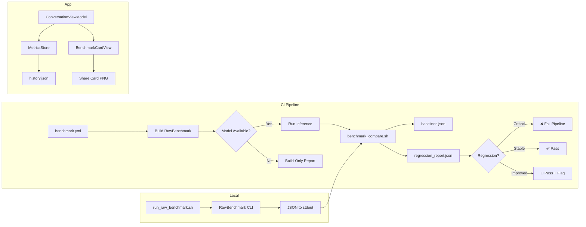

# 📊 Performance Dashboard

> **Edge AI Lab** — On-Device LLM Benchmark Results
>
> _The GeekBench of edge AI inference._

---

## Latest Baselines

Measured on **MacBook Pro M4 Max** · **macOS 26** · **36 GB Unified Memory**

| Model | Backend | Decode (tok/s) | Prefill (tok/s) | TTFT (s) | Median Latency | P95 Latency | Load Time |
|-------|---------|---------------:|----------------:|---------:|---------------:|------------:|----------:|
| Gemma 4 E2B Standard | GPU (Metal) | **103.16** | 215.0 | 0.150 | 10.0 ms | 18.0 ms | 2.5s |
| Gemma 4 E2B Mobile GPU | GPU (Metal) | **94.12** | 200.0 | 0.180 | 11.0 ms | 20.0 ms | 2.2s |
| Gemma 3n E2B | GPU (Metal) | **66.79** | 150.0 | 0.250 | 15.0 ms | 25.0 ms | 2.0s |
| Gemma 4 E2B Standard | CPU (XNNPACK) | **28.71** | 50.0 | 0.600 | 35.0 ms | 55.0 ms | 3.0s |

### Performance Tiers

```
🟢 Excellent  ≥ 80 tok/s    ██████████████████████████████████  103.16 (E2B Standard GPU)
🟢 Excellent  ≥ 80 tok/s    ████████████████████████████████    94.12  (E2B Mobile GPU)
🔵 Great      ≥ 40 tok/s    ██████████████████████              66.79  (Gemma 3n E2B)
🟡 Good       ≥ 20 tok/s    █████████                           28.71  (E2B CPU Fallback)
```

---

## Methodology

### RawBenchmark v2

All measurements use the **RawBenchmark** CLI tool (`RawBenchmark/main.swift`), which provides bare-metal LiteRT-LM inference without any SwiftUI overhead:

| Parameter | Value |
|-----------|-------|
| Sampler | Greedy (topK=1, topP=1.0, temp=1.0) |
| Max Decode Tokens | 256 |
| Warmup | None (first-turn benchmark) |
| MTP | Disabled |
| Prompt | ~30 words on transformer attention mechanisms |

### Metrics Collected

| Metric | Source | Description |
|--------|--------|-------------|
| **SDK Decode** | `LiteRTLM.BenchmarkInfo` | SDK-reported decode throughput |
| **SDK Prefill** | `LiteRTLM.BenchmarkInfo` | SDK-reported prefill throughput |
| **SDK TTFT** | `LiteRTLM.BenchmarkInfo` | SDK-reported time to first token |
| **Wall Decode** | Wall-clock timing | Pure decode speed (excludes TTFT) |
| **Median Latency** | Per-token timestamps | 50th percentile inter-token delay |
| **P95 Latency** | Per-token timestamps | 95th percentile inter-token delay |
| **Model Load** | Wall-clock timing | Time from `Engine.initialize()` to ready |
| **Memory Delta** | `mach_task_basic_info` | Unified memory consumed by model |
| **Thermal State** | `ProcessInfo.thermalState` | Pre/post inference thermal level |

---

## Regression Detection

The CI pipeline automatically compares benchmark results against [`metrics/baselines.json`](baselines.json):

| Metric | Threshold | Severity | Direction |
|--------|-----------|----------|-----------|
| SDK Decode (tok/s) | 10% | 🔴 Critical | Higher is better |
| Wall Decode (tok/s) | 10% | 🔴 Critical | Higher is better |
| SDK Prefill (tok/s) | 15% | 🟡 Warning | Higher is better |
| SDK TTFT (s) | 20% | 🟡 Warning | Lower is better |
| Median Latency (ms) | 15% | 🟡 Warning | Lower is better |
| P95 Latency (ms) | 25% | 🔵 Info | Lower is better |
| Model Load (s) | 30% | 🔵 Info | Lower is better |

**Critical** regressions fail the CI pipeline. **Warning** and **Info** regressions are reported but don't block.

---

## Running Benchmarks

### Locally

```bash
# Build and run with a model
./automation/run_raw_benchmark.sh

# Or run directly
tuist generate --no-open
xcodebuild -workspace EdgeAILab.xcworkspace \
  -scheme RawBenchmark -configuration Release build
# Find binary in DerivedData and run:
./RawBenchmark path/to/model.litertlm > results.json
```

### Via CI

```bash
# Manual dispatch with model path (GitHub Actions)
gh workflow run benchmark.yml \
  -f model_path="/path/to/model.litertlm" \
  -f regression_threshold=10
```

### Compare Against Baselines

```bash
./automation/benchmark_compare.sh \
  --results results.json \
  --baselines metrics/baselines.json \
  --threshold 10 \
  --output regression_report.json
```

---

## Architecture



---

## Cross-Platform Eval Comparison

Eval suite pass rates compared across platforms. See [`CROSS_PLATFORM_REPORT.md`](CROSS_PLATFORM_REPORT.md) for the full auto-generated report.

| Suite | macOS (M4 Max) | iOS (iPhone 16 Pro Max) | Baseline | Status |
|-------|:--------------:|:----------------------:|:--------:|:------:|
| Math Accuracy | 90% | 90% | 90% | ✅ Match |
| Tool Calling Reliability | 100% | 100% | 100% | ✅ Match |
| Reasoning | 100% | 88% | 88% | ⚠️ iOS -12pp |
| Multimodal | 100% | 100% | 100% | ✅ Match |

> **Note**: Reasoning score difference (100% macOS vs 88% iOS) is expected — mobile GPU precision causes 1/8 prompts to produce slightly different reasoning chains. The eval baseline reflects the iOS-observed pass rate.

### Generating the Report

```bash
# Generate cross-platform comparison from latest results
./automation/eval_comparison.sh

# Or as part of the full test matrix
./automation/run_full_matrix.sh
```

---

## Historical Notes

### 2026-05-31 — Initial Baselines
- First structured benchmark run on MacBook Pro M4 Max
- Established baselines for 4 model/backend configurations
- SDK decode speed: **103.16 tok/s** (Gemma 4 E2B Standard, GPU)

### 2026-06-01 — iPhone 16 Pro Max
- Physical device benchmarks via `run_matrix.py`
- Standard Model GPU: **14.50 tok/s** decode
- E4B variants: 4.47–17.42 tok/s range

### 2026-06-09 — Phase 2 Complete
- Added shareable benchmark cards (1200×630 PNG)
- 36 unit tests for benchmark card feature
- Fixed MockInstrumentedEngine and SprintFeatureIntegrationTests

### 2026-06-17 — Full Cross-Platform Coverage
- Added 7 new iOS flow-driven UI tests (accessibility, orientation, onboarding, downloads, conversations, model lifecycle, error recovery)
- `performAccessibilityAudit()` integration for automated a11y testing
- Release build support for device benchmarks (fixes Jetsam kills)
- Cross-platform eval comparison report (`eval_comparison.sh`)
- Single-command test matrix runner (`run_full_matrix.sh`)
- Pre-flight memory check in benchmark pipeline

---

_Dashboard auto-generated from [`metrics/baselines.json`](baselines.json). Last updated: 2026-06-17._

